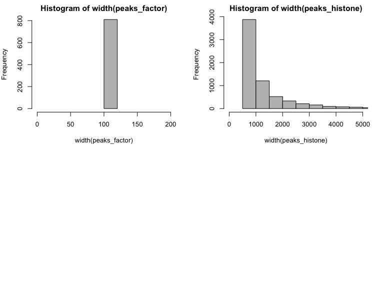
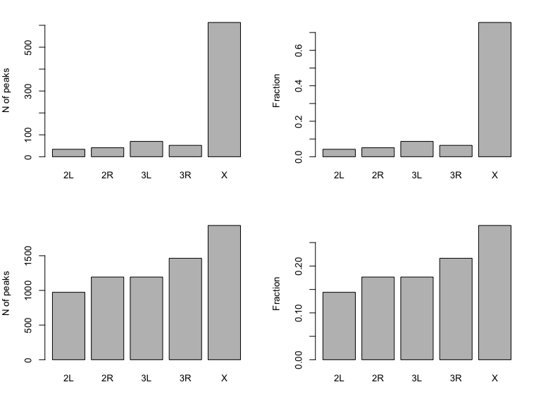
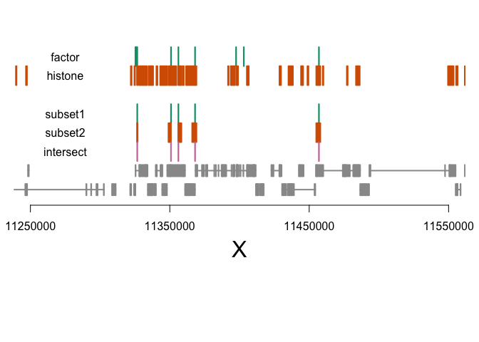
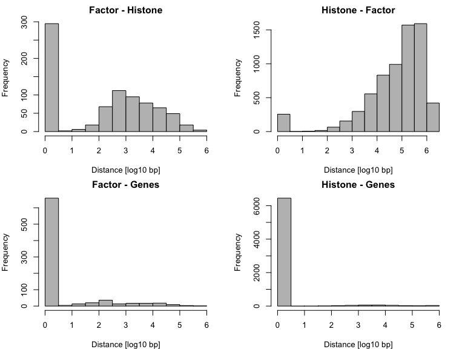
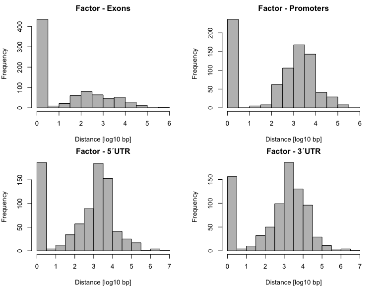
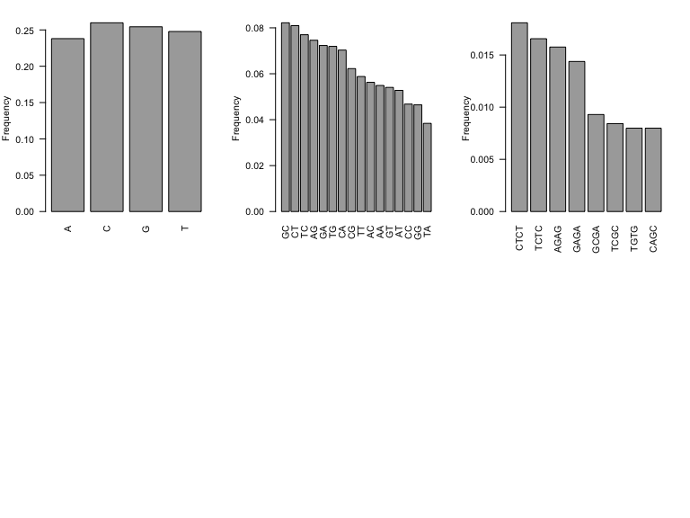

# Introduction

## Resources

https://www.bioconductor.org/packages/release/bioc/html/GenomicRanges.html

https://www.bioconductor.org/packages/release/bioc/vignettes/GenomicRanges/inst/doc/GRanges_and_GRangesList_slides.pdf


## Import Files


```r
library(rtracklayer)
library(GenomicRanges)

peaks_factor <- import.bed("peaks/peaks.factor.bed")
peaks_histone <- import.bed("peaks/peaks.histone.bed")


peaks_factor; peaks_histone
```

```
## GRanges object with 810 ranges and 0 metadata columns:
##         seqnames               ranges strand
##            <Rle>            <IRanges>  <Rle>
##     [1]        X [17821648, 17821765]      *
##     [2]        X [11580189, 11580306]      *
##     [3]        X [21050158, 21050275]      *
##     [4]        X [ 3861286,  3861403]      *
##     [5]        X [13200955, 13201072]      *
##     ...      ...                  ...    ...
##   [806]       3L [28001127, 28001244]      *
##   [807]       3L [  409776,   409893]      *
##   [808]        X [ 3761339,  3761456]      *
##   [809]        X [ 8992797,  8992914]      *
##   [810]        X [12945307, 12945424]      *
##   -------
##   seqinfo: 5 sequences from an unspecified genome; no seqlengths
```

```
## GRanges object with 6760 ranges and 0 metadata columns:
##          seqnames               ranges strand
##             <Rle>            <IRanges>  <Rle>
##      [1]        X [ 2708216,  2739750]      *
##      [2]        X [20391377, 20414239]      *
##      [3]        X [ 1455094,  1483631]      *
##      [4]        X [21345106, 21361244]      *
##      [5]        X [19850951, 19865622]      *
##      ...      ...                  ...    ...
##   [6756]        X [19382310, 19382809]      *
##   [6757]        X [18272777, 18273276]      *
##   [6758]        X [16706182, 16706681]      *
##   [6759]        X [11980715, 11981214]      *
##   [6760]        X [ 1226994,  1227493]      *
##   -------
##   seqinfo: 5 sequences from an unspecified genome; no seqlengths
```

## Genomic Ranges


```r
# sorting
peaks_factor <- sortSeqlevels(peaks_factor)
peaks_factor <- sort(peaks_factor)

peaks_histone <- sortSeqlevels(peaks_histone)
peaks_histone <- sort(peaks_histone)

peaks_factor; peaks_histone
```

```
## GRanges object with 810 ranges and 0 metadata columns:
##         seqnames               ranges strand
##            <Rle>            <IRanges>  <Rle>
##     [1]       2L   [1644537, 1644654]      *
##     [2]       2L   [2196585, 2196702]      *
##     [3]       2L   [2885828, 2885945]      *
##     [4]       2L   [3534228, 3534345]      *
##     [5]       2L   [3656848, 3656965]      *
##     ...      ...                  ...    ...
##   [806]        X [23014961, 23015078]      *
##   [807]        X [23100523, 23100640]      *
##   [808]        X [23105927, 23106044]      *
##   [809]        X [23253372, 23253489]      *
##   [810]        X [23318260, 23318377]      *
##   -------
##   seqinfo: 5 sequences from an unspecified genome; no seqlengths
```

```
## GRanges object with 6760 ranges and 0 metadata columns:
##          seqnames               ranges strand
##             <Rle>            <IRanges>  <Rle>
##      [1]       2L     [ 69407,  69906]      *
##      [2]       2L     [ 72418,  73294]      *
##      [3]       2L     [ 86187,  86951]      *
##      [4]       2L     [102320, 102949]      *
##      [5]       2L     [106194, 106818]      *
##      ...      ...                  ...    ...
##   [6756]        X [23414803, 23415429]      *
##   [6757]        X [23446408, 23447510]      *
##   [6758]        X [23470398, 23471091]      *
##   [6759]        X [23524421, 23524920]      *
##   [6760]        X [23525810, 23526309]      *
##   -------
##   seqinfo: 5 sequences from an unspecified genome; no seqlengths
```


```r
# chromosome naming
seqlevelsStyle(peaks_factor)
```

```
## [1] "NCBI"    "Ensembl"
```

```r
# start position
start(peaks_factor)[1:5]
```

```
## [1] 1644537 2196585 2885828 3534228 3656848
```

```r
# strand
strand(peaks_factor)
```

```
## factor-Rle of length 810 with 1 run
##   Lengths: 810
##   Values :   *
## Levels(3): + - *
```


## Annotation


```r
library(TxDb.Dmelanogaster.UCSC.dm6.ensGene)

txdb <- TxDb.Dmelanogaster.UCSC.dm6.ensGene
seqlevelsStyle(txdb)
```

```
## [1] "UCSC"
```

```r
seqlevelsStyle(txdb) <- "Ensembl"

gene_anno <- genes(txdb)
exon_anno <- reduce(exons(txdb))

gene_anno
```

```
## GRanges object with 17522 ranges and 1 metadata column:
##               seqnames               ranges strand |     gene_id
##                  <Rle>            <IRanges>  <Rle> | <character>
##   FBgn0000003       3R [ 6822498,  6822796]      + | FBgn0000003
##   FBgn0000008       2R [22136968, 22172834]      + | FBgn0000008
##   FBgn0000014       3R [16807214, 16830049]      - | FBgn0000014
##   FBgn0000015       3R [16927210, 16972236]      - | FBgn0000015
##   FBgn0000017       3L [16615866, 16647882]      - | FBgn0000017
##           ...      ...                  ...    ... .         ...
##   FBgn0267791       2R [20587551, 20606854]      + | FBgn0267791
##   FBgn0267792       2R [ 8600415,  8612295]      + | FBgn0267792
##   FBgn0267793       2R [16297449, 16306695]      - | FBgn0267793
##   FBgn0267794       3L [17934032, 17946114]      + | FBgn0267794
##   FBgn0267795       3L [14053215, 14071583]      + | FBgn0267795
##   -------
##   seqinfo: 1870 sequences (1 circular) from dm6 genome
```


```r
library(BSgenome.Dmelanogaster.UCSC.dm6)

genome <- BSgenome.Dmelanogaster.UCSC.dm6
seqlevelsStyle(genome) <- "Ensembl"

seqinfo(genome)
```

```
## Seqinfo object with 1870 sequences (1 circular) from dm6 genome:
##   seqnames         seqlengths isCircular genome
##   2L                 23513712      FALSE    dm6
##   2R                 25286936      FALSE    dm6
##   3L                 28110227      FALSE    dm6
##   3R                 32079331      FALSE    dm6
##   4                   1348131      FALSE    dm6
##   ...                     ...        ...    ...
##   chrUn_DS485998v1       1003      FALSE    dm6
##   chrUn_DS486002v1       1001      FALSE    dm6
##   chrUn_DS486004v1       1001      FALSE    dm6
##   chrUn_DS486005v1       1001      FALSE    dm6
##   chrUn_DS486008v1       1001      FALSE    dm6
```

# Exercises


### Question 1

### What is the size distribution of the peaks?
(histogram)


<button class="btn btn-primary" data-toggle="collapse" data-target="#Question1"> Show/Hide </button>  
<div id="Question1" class="collapse">  


```r
par(mfrow=c(2,2), mar=c(4,4,2,2), oma=c(0,0,0,0))

hist(width(peaks_factor), breaks=100, xlim = c(0, 200), col="grey")

hist(width(peaks_histone), breaks=100, xlim = c(0, 5000), col="grey")
```



</div>


### Question 2

### What is the chromosomal distribution of the peaks?
(barplot)


<button class="btn btn-primary" data-toggle="collapse" data-target="#Question2"> Show/Hide </button>  
<div id="Question2" class="collapse">  


```r
par(mfrow=c(2,2),mar=c(4,4,2,2),oma=c(0,0,0,0))

barplot(table(seqnames(peaks_factor)), ylab="N of peaks")
barplot(table(seqnames(peaks_factor))/length(peaks_factor), ylab="Fraction")


barplot(table(seqnames(peaks_histone)), ylab="N of peaks")
barplot(table(seqnames(peaks_histone))/length(peaks_histone), ylab="Fraction")
```



</div>


### Question 3

### What is the overlap between histone and factor peaks?
* subset of histone overlapping factor
* subset of factor overlapping histone
* intersect of histone and factor


<button class="btn btn-primary" data-toggle="collapse" data-target="#Question3"> Show/Hide </button>  
<div id="Question3" class="collapse">  


```r
subsetByOverlaps(peaks_factor, peaks_histone)
```

```
## GRanges object with 294 ranges and 0 metadata columns:
##         seqnames               ranges strand
##            <Rle>            <IRanges>  <Rle>
##     [1]       2L [ 6098975,  6099092]      *
##     [2]       2R [ 4312157,  4312274]      *
##     [3]       2R [ 5209407,  5209524]      *
##     [4]       2R [ 6236142,  6236259]      *
##     [5]       2R [14360198, 14360315]      *
##     ...      ...                  ...    ...
##   [290]        X [22461359, 22461476]      *
##   [291]        X [22461629, 22461746]      *
##   [292]        X [22540082, 22540199]      *
##   [293]        X [23014961, 23015078]      *
##   [294]        X [23100523, 23100640]      *
##   -------
##   seqinfo: 5 sequences from an unspecified genome; no seqlengths
```

```r
subsetByOverlaps(peaks_histone, peaks_factor)
```

```
## GRanges object with 256 ranges and 0 metadata columns:
##         seqnames               ranges strand
##            <Rle>            <IRanges>  <Rle>
##     [1]       2L [ 6097558,  6099112]      *
##     [2]       2R [ 4312158,  4312657]      *
##     [3]       2R [ 5209000,  5209499]      *
##     [4]       2R [ 6233777,  6236375]      *
##     [5]       2R [14359788, 14360412]      *
##     ...      ...                  ...    ...
##   [252]        X [21369490, 21372653]      *
##   [253]        X [22460449, 22467882]      *
##   [254]        X [22539641, 22543835]      *
##   [255]        X [23012199, 23015089]      *
##   [256]        X [23097430, 23102298]      *
##   -------
##   seqinfo: 5 sequences from an unspecified genome; no seqlengths
```

```r
intersect(peaks_histone, peaks_factor)
```

```
## GRanges object with 294 ranges and 0 metadata columns:
##         seqnames               ranges strand
##            <Rle>            <IRanges>  <Rle>
##     [1]       2L [ 6098975,  6099092]      *
##     [2]       2R [ 4312158,  4312274]      *
##     [3]       2R [ 5209407,  5209499]      *
##     [4]       2R [ 6236142,  6236259]      *
##     [5]       2R [14360198, 14360315]      *
##     ...      ...                  ...    ...
##   [290]        X [22461359, 22461476]      *
##   [291]        X [22461629, 22461746]      *
##   [292]        X [22540082, 22540199]      *
##   [293]        X [23014961, 23015078]      *
##   [294]        X [23100523, 23100640]      *
##   -------
##   seqinfo: 5 sequences from an unspecified genome; no seqlengths
```

```r
intersect(peaks_factor, peaks_histone)
```

```
## GRanges object with 294 ranges and 0 metadata columns:
##         seqnames               ranges strand
##            <Rle>            <IRanges>  <Rle>
##     [1]       2L [ 6098975,  6099092]      *
##     [2]       2R [ 4312158,  4312274]      *
##     [3]       2R [ 5209407,  5209499]      *
##     [4]       2R [ 6236142,  6236259]      *
##     [5]       2R [14360198, 14360315]      *
##     ...      ...                  ...    ...
##   [290]        X [22461359, 22461476]      *
##   [291]        X [22461629, 22461746]      *
##   [292]        X [22540082, 22540199]      *
##   [293]        X [23014961, 23015078]      *
##   [294]        X [23100523, 23100640]      *
##   -------
##   seqinfo: 5 sequences from an unspecified genome; no seqlengths
```

</div>





### Question 4

### What is the average distance between peaks?
(average or histogram) <br>

* histone - factor
* factor - histone
* histone - genes
* factor - genes

<button class="btn btn-primary" data-toggle="collapse" data-target="#Question4"> Show/Hide </button>  
<div id="Question4" class="collapse">  


```r
par(mfrow=c(2,2), mar=c(4,4,2,2), oma=c(0,0,0,0))

hist(log10(mcols(distanceToNearest(peaks_factor, peaks_histone))$distance+1), 
     xlab="Distance [log10 bp]", main="Factor - Histone", col="grey")

hist(log10(mcols(distanceToNearest(peaks_histone,peaks_factor))$distance+1), 
     xlab="Distance [log10 bp]", main="Histone - Factor", col="grey")


hist(log10(mcols(distanceToNearest(peaks_factor, gene_anno))$distance+1), 
     xlab="Distance [log10 bp]", main="Factor - Genes", col="grey")

hist(log10(mcols(distanceToNearest(peaks_histone, gene_anno))$distance+1), 
     xlab="Distance [log10 bp]", main="Histone - Genes", col="grey")
```



</div>


### Question 5

### What is the distance of factor peaks to exons, promoters, 5´UTRs, 3´UTs?
Promoter: TSS +/- 250 bp <br>
Hint: ?promoters; ?threeUTRsByTranscript etc.


<button class="btn btn-primary" data-toggle="collapse" data-target="#Question5"> Show/Hide </button>  
<div id="Question5" class="collapse">  


```r
promoter_anno <-  promoters(txdb, upstream=250, downstream=250)
threeUTR_anno <- unlist(threeUTRsByTranscript(txdb))
fiveUTR_anno <-  unlist(fiveUTRsByTranscript(txdb))

par(mfrow=c(2,2), mar=c(4,4,2,2), oma=c(0,0,0,0))

hist(log10(mcols(distanceToNearest(peaks_factor, exon_anno))$distance+1), 
     xlab="Distance [log10 bp]", main="Factor - Exons", col="grey")

hist(log10(mcols(distanceToNearest(peaks_factor, promoter_anno))$distance+1), 
     xlab="Distance [log10 bp]", main="Factor - Promoters", col="grey")

hist(log10(mcols(distanceToNearest(peaks_factor, fiveUTR_anno))$distance+1), 
     xlab="Distance [log10 bp]", main="Factor - 5´UTR", col="grey")

hist(log10(mcols(distanceToNearest(peaks_factor, threeUTR_anno))$distance+1), 
     xlab="Distance [log10 bp]", main="Factor - 3´UTR", col="grey")
```




</div>


### Question 6

### What is the G,A,T,C frequency at the center of factor peaks?
center: 20 bp (hint: resize) <br>
get sequence from genome <br>

* letter frequency
* dinucleotide frequency 
* oligonucleotide frequency (4-mer) 


<button class="btn btn-primary" data-toggle="collapse" data-target="#Question6"> Show/Hide </button>  
<div id="Question6" class="collapse">  


```r
peaks_factor_center <- resize(peaks_factor, width = 20, fix = "center")

peak_sequences <- getSeq(genome, peaks_factor_center)

base_counts <- alphabetFrequency(peak_sequences)[,1:4]
base_freq <- colSums(base_counts)/sum(base_counts)

dinuc_counts <- dinucleotideFrequency(peak_sequences)
dinuc_freq <-  colSums(dinuc_counts)/sum(dinuc_counts)

oligo_nuc_counts <- oligonucleotideFrequency(peak_sequences, width = 4)
oligo_nuc_freq <-  colSums(oligo_nuc_counts)/sum(oligo_nuc_counts)


par(mfrow=c(2,3), mar=c(4,4,2,2), oma=c(0,0,0,0))

barplot(base_freq, las=2, col="darkgrey", ylab = "Frequency")
barplot(dinuc_freq[rev(order(dinuc_freq))], las=2, col="darkgrey", ylab = "Frequency")
barplot(oligo_nuc_freq[rev(order(oligo_nuc_freq))][1:8], las=2, col="darkgrey", ylab = "Frequency")
```




</div>


\
\
\
\
\
\
\
\
\
\
\
\
\
\
