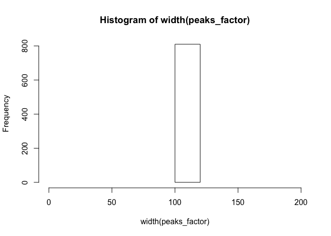
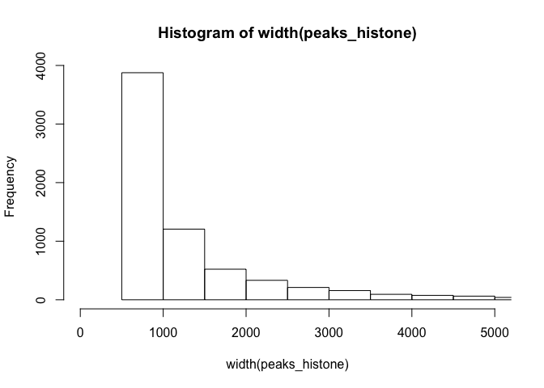

# Introduction

## Resources

https://www.bioconductor.org/packages/release/bioc/html/GenomicRanges.html

https://www.bioconductor.org/packages/release/bioc/vignettes/GenomicRanges/inst/doc/GRanges_and_GRangesList_slides.pdf


## Import Files


```r
library(rtracklayer)
library(GenomicRanges)

peaks_factor <- import.bed("peaks/peaks.factor.bed")
peaks_histone <- import.bed("peaks/peaks.histone.bed")


peaks_factor; peaks_histone
```

```
## GRanges object with 810 ranges and 0 metadata columns:
##         seqnames               ranges strand
##            <Rle>            <IRanges>  <Rle>
##     [1]        X [17821648, 17821765]      *
##     [2]        X [11580189, 11580306]      *
##     [3]        X [21050158, 21050275]      *
##     [4]        X [ 3861286,  3861403]      *
##     [5]        X [13200955, 13201072]      *
##     ...      ...                  ...    ...
##   [806]       3L [28001127, 28001244]      *
##   [807]       3L [  409776,   409893]      *
##   [808]        X [ 3761339,  3761456]      *
##   [809]        X [ 8992797,  8992914]      *
##   [810]        X [12945307, 12945424]      *
##   -------
##   seqinfo: 5 sequences from an unspecified genome; no seqlengths
```

```
## GRanges object with 6760 ranges and 0 metadata columns:
##          seqnames               ranges strand
##             <Rle>            <IRanges>  <Rle>
##      [1]        X [ 2708216,  2739750]      *
##      [2]        X [20391377, 20414239]      *
##      [3]        X [ 1455094,  1483631]      *
##      [4]        X [21345106, 21361244]      *
##      [5]        X [19850951, 19865622]      *
##      ...      ...                  ...    ...
##   [6756]        X [19382310, 19382809]      *
##   [6757]        X [18272777, 18273276]      *
##   [6758]        X [16706182, 16706681]      *
##   [6759]        X [11980715, 11981214]      *
##   [6760]        X [ 1226994,  1227493]      *
##   -------
##   seqinfo: 5 sequences from an unspecified genome; no seqlengths
```

## Genomic Ranges


```r
# sorting
peaks_factor <- sortSeqlevels(peaks_factor)
peaks_factor <- sort(peaks_factor)

peaks_histone <- sortSeqlevels(peaks_histone)
peaks_histone <- sort(peaks_histone)

peaks_factor; peaks_histone
```

```
## GRanges object with 810 ranges and 0 metadata columns:
##         seqnames               ranges strand
##            <Rle>            <IRanges>  <Rle>
##     [1]       2L   [1644537, 1644654]      *
##     [2]       2L   [2196585, 2196702]      *
##     [3]       2L   [2885828, 2885945]      *
##     [4]       2L   [3534228, 3534345]      *
##     [5]       2L   [3656848, 3656965]      *
##     ...      ...                  ...    ...
##   [806]        X [23014961, 23015078]      *
##   [807]        X [23100523, 23100640]      *
##   [808]        X [23105927, 23106044]      *
##   [809]        X [23253372, 23253489]      *
##   [810]        X [23318260, 23318377]      *
##   -------
##   seqinfo: 5 sequences from an unspecified genome; no seqlengths
```

```
## GRanges object with 6760 ranges and 0 metadata columns:
##          seqnames               ranges strand
##             <Rle>            <IRanges>  <Rle>
##      [1]       2L     [ 69407,  69906]      *
##      [2]       2L     [ 72418,  73294]      *
##      [3]       2L     [ 86187,  86951]      *
##      [4]       2L     [102320, 102949]      *
##      [5]       2L     [106194, 106818]      *
##      ...      ...                  ...    ...
##   [6756]        X [23414803, 23415429]      *
##   [6757]        X [23446408, 23447510]      *
##   [6758]        X [23470398, 23471091]      *
##   [6759]        X [23524421, 23524920]      *
##   [6760]        X [23525810, 23526309]      *
##   -------
##   seqinfo: 5 sequences from an unspecified genome; no seqlengths
```


```r
# chromosome naming
seqlevelsStyle(peaks_factor)
```

```
## [1] "NCBI"    "Ensembl"
```

```r
# start position
start(peaks_factor)[1:5]
```

```
## [1] 1644537 2196585 2885828 3534228 3656848
```

```r
# strand
strand(peaks_factor)
```

```
## factor-Rle of length 810 with 1 run
##   Lengths: 810
##   Values :   *
## Levels(3): + - *
```


## Annotation


```r
library(TxDb.Dmelanogaster.UCSC.dm6.ensGene)

gene_anno <- genes(TxDb.Dmelanogaster.UCSC.dm6.ensGene)

gene_anno
```

```
## GRanges object with 17522 ranges and 1 metadata column:
##               seqnames               ranges strand |     gene_id
##                  <Rle>            <IRanges>  <Rle> | <character>
##   FBgn0000003    chr3R [ 6822498,  6822796]      + | FBgn0000003
##   FBgn0000008    chr2R [22136968, 22172834]      + | FBgn0000008
##   FBgn0000014    chr3R [16807214, 16830049]      - | FBgn0000014
##   FBgn0000015    chr3R [16927210, 16972236]      - | FBgn0000015
##   FBgn0000017    chr3L [16615866, 16647882]      - | FBgn0000017
##           ...      ...                  ...    ... .         ...
##   FBgn0267791    chr2R [20587551, 20606854]      + | FBgn0267791
##   FBgn0267792    chr2R [ 8600415,  8612295]      + | FBgn0267792
##   FBgn0267793    chr2R [16297449, 16306695]      - | FBgn0267793
##   FBgn0267794    chr3L [17934032, 17946114]      + | FBgn0267794
##   FBgn0267795    chr3L [14053215, 14071583]      + | FBgn0267795
##   -------
##   seqinfo: 1870 sequences (1 circular) from dm6 genome
```


# Exercises


### Question 1

What is the size distribution of the peaks?
(histogram)


<button class="btn btn-primary" data-toggle="collapse" data-target="#SessionInfo"> Show/Hide </button>  
<div id="SessionInfo" class="collapse">  


```r
hist(width(peaks_factor), breaks=100, xlim = c(0, 200))
```



```r
hist(width(peaks_histone), breaks=100, xlim = c(0, 5000))
```




</div>
